# 1. node stream 的 上传文件的应用场景

- [1. node stream 的 上传文件的应用场景](#1-node-stream-的-上传文件的应用场景)
  - [1.1. 背景](#11-背景)
    - [1.1.1. 原始目标描述](#111-原始目标描述)
    - [1.1.2. 启发](#112-启发)
  - [1.2. 开始](#12-开始)
    - [1.2.1. 创建可读流](#121-创建可读流)
  - [1.3. 创建 Transform 流](#13-创建-transform-流)
  - [1.4. 创建可写流](#14-创建可写流)
  - [1.5. 总结](#15-总结)

## 1.1. 背景

希望实现一个功能：项目构建出的代码整个文件夹上传到公司的 `oss` 上。

上传 oss 很简单，读取文件，然后一个个传呗。但是，会存在一次性上传太多文件，系统卡的问题。
这时候“并发控制”就显得颇为友好。

### 1.1.1. 原始目标描述

初步设想：上传 `oss` 时使用 `Promise` 并发（这种方式是已经熟知的方式了，在项目的其他地方也有做过），然后加入重试逻辑。

存在的问题：

- 需要一次性读取全部的文件，文件少了还好，文件多了，就是大的 `Object`。

想要解决这个问题使用自己封装的`Promise`也没问题，就是读文件也是用并发，就相当于是：***先并发读取目录，然后并发上传文件***。但是仍然存在问题：

- 如何协调，读文件和上传文件这两个并发列表。

### 1.1.2. 启发

来自美团的一篇技术博客[Node.js Stream - 进阶篇](https://tech.meituan.com/2016/07/15/stream-internals.html)，然后找到了可能遇到的问题叫：数据流中积压问题，学名：[背压 （backpressuring）](https://nodejs.org/zh-cn/docs/guides/backpressuring-in-streams/)。

其中提到了：[gulp](https://github.com/gulpjs/gulp) 那么我能不能实现一个类似的操作呢，语法如下:

```js
gulp
 .src(['src']) // #1
 .pipe(uploadFile()) // #2
 .pipe(log()) // #3
```

- #1 创建一个可读流，用来读文件
- #2 创建一个转换流，用来上传文件到 `oss`
- #3 创建一个可写流，用来打印上传成功的文件

注： 如果想要学习 `stream` 建议先阅读一下 美团的那三篇相关的技术博客，这里涉及到用作功能实现的相关 `api`。

## 1.2. 开始

### 1.2.1. 创建可读流

先实现 `#1` 位置的代码。这里需要注意，可读流存在 “流动模式” 和 “暂停模式”，直观上看很好理解，但是体现在代码上就很多坑。踩了好久

先看一个市面上常见的例子：

```js
// demo1.js
const Stream = require('stream')

const candidate = 'abcde'.split('')
const readable = new Stream.Readable({
 read() {
  while(candidate.length) {
   this.push(`\n${candidate.pop()}`)
  }
 }
})

readable.pipe(process.stdout)
// 输出如下:
// $ node ./demo1.js

// e
// d
// c
// b
// a
```

这里表现就是，“流动模式”。那么暂停模式是什么样子呢？举个例子

```js
// demo1.pause.js
const Stream = require('stream')

const candidate = 'abcde'.split('')
const readable = new Stream.Readable({
 read() {
  if (candidate.length) {
   this.push(candidate.shift())
  } else {
   this.push(null)
  }
 }
})

readable.pause()
readable.on('data', data => process.stdout.write(`\ndata: ${data}`))
// 暂停模式之所以叫暂停模式，是因为需要手动触发
// const data = readable.read()
// console.log('\n', data.toString()) // a
// const data2 = readable.read()
// console.log('\n', data2.toString()) // b

while(readable.read() !== null);
// 输出如下：
// $ node demo1.pause.js

// data: a
// data: b
// data: c
// data: d
// data: e
```

那么这里可读流能异步不，答案是可以的，看下面这个例子

```js
// demo1.async.js
const Stream = require('stream')

const candidate = 'abcde'.split('')
const readable = new Stream.Readable({
 read() {
  process.nextTick(() => { // +
   if (candidate.length) {
    this.push(candidate.shift())
   } else {
    this.push(null)
   }
  }) // +
 }
})

readable.pause()
readable.on('data', data => process.stdout.write(`\ndata: ${data}`))
// 暂停模式之所以叫暂停模式，是因为需要手动触发
// const data = readable.read()
// console.log('\n', data.toString()) // a
// const data2 = readable.read()
// console.log('\n', data2.toString()) // b

while(readable.read() !== null);

// 没有输出 这是为什么呢？
```

我们看下下面这个例子，只是增加 `readable` 事件。

```js
const Stream = require('stream')

const candidate = 'abcde'.split('')
const readable = new Stream.Readable({
 read() {
  setTimeout(() => { // +
   if (candidate.length) {
    this.push(candidate.shift())
   } else {
    // 可读流结束
    this.push(null)
   }
  }, 1e3); // +
 }
})

// 只要没有push null，每次push数据，就会触发一次 `readable` 事件
// 注意：readable 事件会触发暂停模式
readable.on('readable', () => { // +
 while(readable.read() !== null);
}) // +

readable.pipe(process.stdout)

// 输出
// $ node ./demo1.async.js
// abcde
```

注：`push(null)` 是非必须的，如果前面的可读流对象 `readable`(不是事件) 不会被引用到时自动会关闭可读流。可以留意下面这个例子

```js
const Stream = require('stream')

const candidate = 'abcde'.split('')
const len = candidate.length
const readable = new Stream.Readable({
 read() {
  setTimeout(() => {
   if (candidate.length > len - 2) {
    this.push(candidate.shift())
   // } else { // -
   //  // 可读流结束
   //  this.push(null) // -
   // } else {
   //  this.push(candidate.length.toString()) // -
   }
  }, 1e3);
 }
})

// 只要没有push null，每次push数据，就会触发一次 `readable` 事件
// 注意：readable 事件会触发暂停模式
readable.on('readable', () => {
 console.log('readable')
 let data = readable.read()
 while(data !== null) {
  data = readable.read()
 };
})

setTimeout(() => {
 console.log('here')
 // 这里仍然是可以 触发 readable 事件的
 // 如果上面push了null，这里就不会走到，可读流在push(null)的时候直接就结束了
 readable.push(len.toString())
}, 5e3);

readable.pipe(process.stdout)
// 输入如下：
// $ node ./demo1.async2.js
// readable
// areadable
// bhere
// readable
// 5
```

上面几个例子看明白后，可读流应该会有个新的认知。

下面我们来开始写一个函数来做读文件夹的pipe:

```js
// 注意这里是 同步的
// 维护一个队列，拿到所有的文件和文件夹，只有后面消耗掉了才会接着 push
const Stream = require('stream')
const { Readable } = Stream
const fs = require('fs')
const path = require('path')

const fileReaderPipeWrapper = () => {
 /**
  * 用来缓存所有的文件的
  */
 let node_queue = []
 let count = 0

 return (
  /**
   * 需要上传的目录
   */
  dirs = [],
  /**
   * Readable 的候选项
   */
  options = {}
 ) => {
  node_queue = dirs.slice()

  const readable = new Readable({
   highWaterMark: 0, // 默认 每次push一次就执行一次上传
   ...options,
   objectMode: true,
   read: function () {
    let pushed = false

    // 确保 每次只 push 一条数据，不存在。如果是文件夹就不 push 的问题
    // while 做的是 如果是目录就得往数组里 push 子文件
    while (!pushed && node_queue.length) {
     // 目标结点
     const filePathLike = node_queue.shift() // 从头部开始取
     // 拼接路径
     const fullPath = path.resolve(process.cwd(), filePathLike)
     const stat = fs.statSync(fullPath)
     if (stat.isFile()) {
      // 开始 push
      // 流转到FileUploadPipe 时会是 完整路径 和 生成的相对路径
      this.push({ fullPath, relativePath: filePathLike }) // 这里只会执行一次
      pushed = true

      // 逻辑无关 >>>
      count++
      // 逻辑无关 <<<
     } else if (stat.isDirectory()) {
      const list = fs.readdirSync(fullPath)
      // 把相对路径推进列表里
      node_queue.push(...list.map(fileName => path.join(filePathLike || '', fileName)))
      pushed = false
     }
    }

    // 结束
    if (!node_queue.length && !pushed) {
     this.push(null)
    }
   }
  })

  // 触发 阻塞模式
  readable.on('readable', () => {
   // 方便调试 这么些容易打断点
   let data = readable.read()

   while (data !== null) {
    data = readable.read()
   }
  })

  readable.on('end', () => {
   process.stdout.write(`\ntotalCount: ${count}\n`)
  })

  return readable
 }
}

/**
 * @param {string} dirs 路径数组
 */
exports.fileReaderPipe = fileReaderPipeWrapper()
```

上面这段代码，做的就是读文件或者文件夹，每次只 `push` 一个文件，如果是文件夹就跳进去找文件，加到队列中，然后从队列中取出来文件。

```js
```

## 1.3. 创建 Transform 流

实现 `#2` 位置的代码。这里的实现就比较好理解了，就类似于 `express` 的中间件，需要调用 `next` 来结束处理。

需要处理的数据，把处理好的数据 `push` 给下的流，然后告诉 `Tarnsform` 处理完了，伪代码描述下

```js
const stream = require('stream')

const trans = new stream.Transform({
 /**
  * chunk 是上游数据
  */
 transform(chunk, encode, cb) {
  // 1. chunk 处理
  //   同步 or 异步
  // 2. 处理完成
  //    没有报错 cb()
  //   报错了 cb(new Error('')) 抛错
 }
})

```

这需要注意的是，这里的 `Transform` 是可以不处理数据的，这样就能实现数据的**收窄**，也可以多次push实现数据的**膨胀**

这块儿不复杂，直接上代码

```js
//  fileUploadPipe.js
const { genClient } = require('@h/ali-oss-wrapper')
const path = require('path')
const Stream = require('stream')
const { CliOptions } = require('./constants')
const { retryFn } = require('./request/retry')
const { getAliOssConfig } = require('./request/useHttpRequest')
const { getCdnDir } = require('./getPrefixDir')

const { Transform } = Stream

/**
 * do 上传文件
 */
exports.fileUploadPipe = (options = {}) => {
 const {
  // 用来发送代理请求
  socksProxy,
  // 用来获取 上传文件时的 默认前缀
  prefixDir,
  // transform 配置项
  ...otherOptions
 } = options
 const transUpload = new Transform({
  highWaterMark: 0, // 默认 每次push一次就执行一次上传
  ...otherOptions,
  objectMode: true,
  transform: async function (chunk, encode, cb) {
   const { fullPath, relativePath } = chunk || {}
   if (!fullPath || !relativePath || typeof prefixDir !== 'string') {
    throw new Error(`文件地址获取失败, ${fullPath}, ${relativePath}, ${prefixDir}`)
   }

   if (relativePath) {
    console.log(`\n${relativePath} 上传中...`)
   }

   // 相对地址
   // 以本地环境为例
   // prefixDir : /projectName/ci.df1235sdf
   // relativePath: vite/env/.env 注意开头没有斜杠
   const targetAddr = path.join(prefixDir, relativePath)

   const aliOssClient = await genClient({
    bucket: CliOptions.DEFAULT_BUCKET,
    region: CliOptions.OSS_REGION,
    getAliOssReqFn: () => retryFn(() => getAliOssConfig({ socksProxy })), // 默认重试 3 次
   })

   // 以本地环境为例
   // target: /projectName/ci.df1235sdf/vite/env/.env
   // fullPath: /User/[username]/[...ProjectDir]/projectName/vite/env/.env
   await aliOssClient.multipartUpload(targetAddr, fullPath)
   this.push({
    relativePath,
    targetAddr,
    fullPath,
    CDNAddr: getCdnDir(relativePath),
   })

   cb()

  },
 })

 return transUpload
}
```

中间还涉及到了一块代码重试的代码比较有意思：

```js
exports.retryFn = async (fn, options = {}) => {
 if (typeof fn !== 'function') {
  throw new new Error('fn 不是函数')
 }

 const { max = 3, delay = 0 } = options
 let curMax = 0
 return new Promise((resolve, reject) => {
  const fnExec = async () => {
   curMax++
   console.log('执行次数', curMax)
   try {
    const res = await fn()
    resolve(res)
   } catch (error) {
    // 用于调试
    if (curMax >= max) {
     reject(error)
     return
    } else {
     setTimeout(() => {
      fnExec()
     }, delay)
    }
   }
  }

  return fnExec()
 })
}
```

## 1.4. 创建可写流

实现 `#3` 位置的代码。这里的代码就跟转换流部分的代码差不多

```js
const Stream = require('stream')
const { Writable } = Stream

exports.fileUploadLog = () => {
 let count = 0
 const fileUploadLogWriteable = new Writable({
  objectMode: true,
  write(chunk, encode, cb) {
   const {
    relativePath,
    targetAddr,
    fullPath,
    CDNAddr,
   } = chunk

   if (relativePath) {
    // 目标地址
    // `https://cdn.com/${project}/${tag}`
    console.log(`远端地址 ${targetAddr}`)
    // `/user/xxx/xxx/filename.ext`
    console.log(`本地地址 ${fullPath}`)
    // `https://cdn.com/${project}/${tag}`
    console.log(`CDN地址 ${CDNAddr}`)
    console.log(`${relativePath} 上传成功\n`)
    count++
    cb()
   }
  }
 })

 fileUploadLogWriteable.on('finish', () => {
  console.log(`文件处理数量 ${count}`)
 })

 return fileUploadLogWriteable
}
```

至此，整个的文件的 `pipe` 读写 就已经完整了。

## 1.5. 总结

整体使用下来的感受：

- 尽量不要想着去控制可读流，而是让流自己控制自己。
- 可以达到，收窄流，也可以膨胀流。



后来又遇到了一个相似的问题，是复制文件的库[copyfiles](https://github.com/calvinmetcalf/copyfiles)没有达到预期结果，就魔改了一下 [copyfile2](https://github.com/dingyanhe/copyfile2)，加深了进一步对流的理解。

还遇到的一些问题：

- [What are the roles of _read and read in Node JS streams?](https://stackoverflow.com/a/62142511/9672709)
- BFS 形式读文件，解决递归无法中断问题。